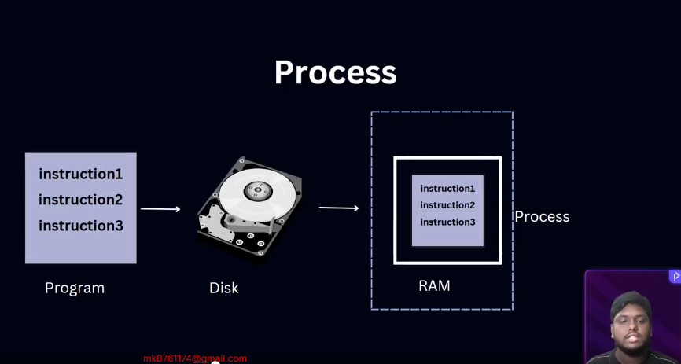
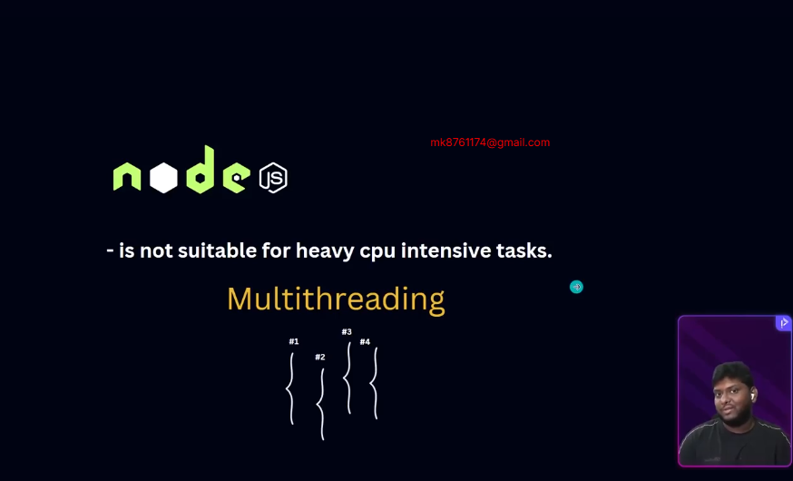

Welcome to the new mission, today we pull back the curtain on how the web truly works and introduce you to the powerful world of Node.js! 🌐


In this module, you'll gain a solid understanding of the internet’s backbone—from how a browser talks to a server, to the difference between frontend and backend, and why Node.js is a game-changer in modern development.


We’ll explore:

The magic of the event loop 🌀 and how Node.js handles millions of requests without breaking a sweat,
The single-threaded nature of Node.js and how it still manages to stay lightning fast ⚡,
How to install Node.js like a pro using fnm (no more versioning nightmares!),
And master the modular system that makes Node.js both clean and powerful—CommonJS, ES Modules, IIFE, index exports—you’ll cover it all!


By the end of this module, you’ll not only understand the “what” but the “why” behind Node.js and how it's structured to be efficient, modular, and scalable. Whether you're building APIs, tools, or full-stack apps, these concepts will level up your backend journey in no time.


Node.JS Documentation: https://nodejs.org/en/learn/getting-started/introduction-to-nodejs


Let’s get started and unlock the server-side superpowers of JavaScript! 💪

# Explore The Fundamentals of Node.js

## 12-1 How the web works
- Request Response Model / Client-Server Architecture

- https ==> Protocol
- web.programming-hero.com ===> Domain name
- success ==> Resource

- Domain Address is not real Address 
- real Address is api address in dns server as like 139.59.2345:443


 ##### tcp/ip socket connection
 - ip = internet protocol
 - tcp = transmission Control Protocol
 
 
## 12-2 Frontend vs Backend Development
###### static web site it is pre make website
- cross device not supported design all device create make extra responsive
- A static website is made up of fixed content — HTML, CSS, and maybe a little JavaScript. The content does not change unless a developer manually updates the code.

###### dynamic web side  server side rendering first order then he is maked
- A dynamic website can show different content and respond to user input. It uses server-side languages (like Node.js, PHP) and databases (like MongoDB, MySQL) to generate content dynamically.


###### Dynamic website client side rendering using api
- This is a modern and popular approach. The frontend is built using frameworks like React.js, and it gets content/data from an API — often from a backend server or a third-party service.


 ###### Benefits of using API
 - cross device supported all device auto design selected phone,laptop etc
 - one data model create multiple device application


## 12-3 Why Node.js was invented

- 2 dependencies


##### LipUv implements 2 important parts of node.js
- 1 even Loop connect with v8 engine
- 2 thread Pool cpu intensive task 


## 12-4 High Level Overview of Node.js Architecture

 ##### what is process?
your instruction ==> Disk ====> Ram (this is process)



 ##### What is a Single Thread?
A thread is like a lane of execution — where your program runs step by step.

A Single Thread means your program runs one task at a time, in order


## 12-5 Single threaded node.js
before we are working in server side in server side  html ,css,js all run in server side  thats why code run  browser specific we are not run in mobile application and browser application

but now we are server side fully run only for backend
the benefit is all device data access easily

##### 2 type tasks
- 1 i/o input,output task
- 2 cpu intensive tasks heavy data he is covered

#### MUlti Thread Server
- 1 any person i/o operation call in data so he came the data in one thread
second any person request any data he come to data another thread  
thats way data easily come in 

 ###### limitation threads problem
 1 server he handel the request but when 11 request is come he is not handeling when 1 server is gape then he receive 11 request 
 ###### limitation handeling 2 types
  - 1 horizontal scaling = add instance server 2,3,4 server total 40 thereades request handeling
  -  2 Vertical scaling = increase the size (cpu,Ram)
  
 ##### those 2 system is very costed thats why node js is best because node js is  single threaded when multiple i/o request is coming node js give data in thread poll he handle it easily  this is not blocking i/o
   
- node js working asynchronous and event loop
   
  - node js is not suitable heavy cpu intensive tasks but we are handeling by Multithreading
  

  ## 12-6 How event loop works
  
  ###### How event Loop Works
   when start event loop then start a callback queues he find where the start event loop and he action it by thread pool
   -    ====== priority list ==========
  - 1 expire timer callback
  - 2 i/o polling and callbacks
  - 3 setimmidate callbacks
   - 4 close callbacks
  
  

  
## 12-7 Install node.js using fnm
 1. MAJOR version
Changes: Big updates that may break backward compatibility.

Example: Adding a completely new structure, removing deprecated functions, or changing core logic.

Example change: 1.4.2 → 2.0.0

 2. MINOR version
Changes: New features added in a backward-compatible way.

Example: Adding a new API endpoint, new component, or new configuration option.

Example change: 1.4.2 → 1.5.0

 3. PATCH version
Changes: Bug fixes or small tweaks that do not affect the API or add new features.

Example: Fixing a broken button, correcting a typo, fixing a logic error.

Example change: 1.4.2 → 1.4.3


  
  # Node.js Installation Using `fnm` (Fast Node Manager)

This guide explains how to install and manage multiple versions of Node.js using `fnm`, without Docker. This is helpful when you need to switch Node versions for different projects.

---

## ✅ Why Use `fnm`?

* Easily switch between multiple Node.js versions.
* Lightweight and faster than alternatives like `nvm`.
* Avoid global conflicts.
* No need to install Node.js directly on the system when using containers like Docker.

---

## 📦 Installation Using `fnm` (Without Docker)

### Step 1: Install `winget` (Skip if already installed)

`winget` is a Windows package manager.

* Comes pre-installed with Windows 10 (build 1809+) and Windows 11.
* If not, download from the [official GitHub repo](https://github.com/microsoft/winget-cli).

### Step 2: Install `fnm` using `winget`

Open PowerShell as Administrator and run:

```powershell
winget install Schniz.fnm
```

### Step 3: Verify Installation

```powershell
fnm --version
```

---

## 🛠 Environment Setup

You may need to manually add the following paths to your **system environment variables**:

```
C:\Users\<YourName>\AppData\Local\Microsoft\WinGet\Packages\Schniz.fnm_Microsoft.Winget.Source_8wekyb3d8bbwe
C:\Users\<YourName>\AppData\Roaming\fnm\aliases\default
```

> ⚠️ Tip: Show hidden files when browsing these directories.

---

## 📅 Installing and Managing Node.js Versions

### Install Node.js v22

```powershell
fnm install 22
fnm use 22
```

### Install and Use Node.js v24

```powershell
fnm install 24
fnm use 24
```

### Check Current Node Version

```powershell
node -v
```

### List Installed Node.js Versions

```powershell
fnm ls
```

---

## ⚙️ Setup Auto Environment with PowerShell

### Step 1: Create PowerShell Profile (if it doesn’t exist)

```powershell
if (-not (Test-Path $profile)) { New-Item $profile -Force }
```

### Step 2: Open the Profile File

```powershell
Invoke-Item $profile
```

### Step 3: Paste the following line inside the profile file

```powershell
fnm env --use-on-cd --shell powershell | Out-String | Invoke-Expression
```

> ✅ This ensures `fnm` works automatically every time you open a new PowerShell terminal.

---

## 🚀 Quick Shortcut Method

### Reinstall Node.js with Shortcut Method (Clean Flow)

```powershell
# Install fnm
winget install Schniz.fnm

# Allow PowerShell scripts
Set-ExecutionPolicy -ExecutionPolicy RemoteSigned -Scope CurrentUser

# Close and reopen Terminal as Administrator

# Install specific Node.js version
fnm install 22

# Use the installed version
fnm use 22

# Confirm ins
```
## 12-8 Modular system in node.js
- var is global scope he all area in call
- when we are call let and let  is not global scope it is functional scope

- 2 same variable when we are call and create a conflig 

conflig solution

but long function we are easy handeling by the common js or esm module system

Modular system
- 1 local module (we create) for example when any function as like add function   create and using our system by the import and export this is local module
- 2 Built in modules (come with node js)
- third party modules (created by others)


## 12-9 Explore commonjs module
- 1 local module 


 
 module.exports file
```js
const a = 10;
const add =(param1,param2)=>  param1 + param2;
module.exports = {a,add}
```
 require
 ```js
 const {a,add}= require ("./file-2.js")
console.log(a)
console.log(add(5,8))
```

📘 CommonJS Module Guide (Export & Import)
Basic Export and Import
file-1.js

```js

const a = 10;
module.exports = a;
file-2.js
```
```js
const var1 = require("./file-1");
console.log(var1);
To run:
```
```js
cd Learning-Node
node file-2.js
Exploring module Object
js
Copy
Edit
const a = 10;
module.exports = a;
console.log(module);
Sample output of console.log(module)
```
```js
{
  id: '.',
  path: '...\\Learning-Node',
  exports: 10,
  filename: '...\\file-1.js',
  loaded: false,
  children: [],
  paths: [...],
  [Symbol(kIsMainSymbol)]: true
}
```
✅ exports: 10 replaces the default empty object.

Export a Function Instead
```js
const a = 10;
const add = (p1, p2) => p1 + p2;
module.exports = add;
console.log(module);
```
Export Multiple Values
```js


const a = 10;
const add = (p1, p2) => p1 + p2;
module.exports = { a, add };
console.log(module);
file-2.js


const var1 = require("./file-1");
console.log(var1); // { a: 10, add: [Function: add] }
console.log(var1.a);
console.log(var1.add(2, 3));
Destructuring:

const { a, add } = require("./file-1");
console.log(a);
console.log(add(2, 3));
🔀 Named Exports, Aliasing & Index Export
Avoid name conflicts using aliasing:


const { a, add } = require("./file-1");
const { a: a3, add: add3, b: b3 } = require("./file-3");

console.log(a3);
console.log(add3(2, 3, 6));
console.log(b3);
Alternative (no destructuring):


const var1 = require("./file-1");
const { a, add: add3, b } = require("./file-3");

console.log(var1.a);
console.log(var1.add(2, 3));
console.log(a);
console.log(add3(2, 3, 6));
console.log(b);
 Organizing Utilities with Index File
utils/add.js


const add = (p1, p2) => p1 + p2;
module.exports = { add };
utils/subtract.js


const subtract = (p1, p2) => p1 - p2;
module.exports = { subtract };
main.js (Direct import)


const { add } = require("./utils/add");
const { subtract } = require("./utils/subtract");

console.log(add(3, 2));
console.log(subtract(3, 2));
✅ Cleaner Import via Index File
utils/index.js


const { add } = require("./add");
const { subtract } = require("./subtract");
module.exports = { add, subtract };
main.js
```
```js


// Option 1
const { add, subtract } = require("./utils/index");

// Option 2 (recommended)
const { add, subtract } = require("./utils");

console.log(add(3, 2));
console.log(subtract(3, 2));
```

## 12-11 IIFE immediately invoked function express a Module Wrapper
- window he is as like object all function  under it
- but 
global function but require and module not global function

###### block scope function

###### require and and module it is not global function but how is it access

this is block scope console not working because let in block scope
``` js

((name)=>{
    let a= 10
    console.log(`learning ${name}`);
})("node");
console.log(a)
``` 

right now work it because let call in global scope

```js
 let a = 10;
((name)=>{
   
    console.log(`learning ${name}`);
})("node");
console.log(a)
```
==============> when run node command he hiddenly run module ,require ,_ _ directName etc 


when console  global
 ``` js
console.log(global )
``` 
```js
PS D:\next-level\nodeJs\Explore-TheFundamentals-Node-js> node iife.js
learning node
10
<ref *1> Object [global] {
  global: [Circular *1],
  clearImmediate: [Function: clearImmediate],
  setImmediate: [Function: setImmediate] {
    [Symbol(nodejs.util.promisify.custom)]: [Getter]
  },
  clearInterval: [Function: clearInterval],
  clearTimeout: [Function: clearTimeout],
  setInterval: [Function: setInterval],
  setTimeout: [Function: setTimeout] {
    [Symbol(nodejs.util.promisify.custom)]: [Getter]
  },
  queueMicrotask: [Function: queueMicrotask],
  structuredClone: [Function: structuredClone],
  atob: [Function: atob],
  btoa: [Function: btoa],
  performance: [Getter/Setter],
  fetch: [Function: fetch],
  navigator: [Getter],
  crypto: [Getter]
}
```
 - but you look it module export not found in this 

actually he call it hiddenly

## 12-12 ES module & module summary


## 12-12 ESM module and Summary

- Initially the purpose of js was to bring interactivity (Dom manipulation) in website.
- when we have started to use node.js and write js in server. that means now js have to handle logic in server and so many more. So there will be a lot of js files. We will must need a modular system.
- Initially There were no modular system built in inside Javascript.
- Node.js Brought the modular system and started to use `Common Js` system of js.
- After node.js version 14 Node.js allowed us to use `ESM` Module. now we can import and export directly.

#### Now Lets See The ESM Module system in practical.

- ESM Files extension is `.mjs`.
- we can not use `Module.export = {}` and `Require` in mjs file we have to use `export{}` and `import` here. these are named export
- console.log(module) we will not get any module here since IIFE is not present here.
- in import we have to say directly with the file extension .mjs

```js
import var1 from "./file-1.mjs";
```

- we can do name aliasing here.

```js
import { a as A3, b as B3, add as Add3 } from "./file-3.mjs";
```

#### Now Lets See Default Exports

```js
export default add;
```

- The facility of default export is we can import them in any name.

```js
import add from "./file-1.mjs";
console.log(add(2, 3));
```

- lets rename. and for renaming we do not need `as` for this. we can give any name.

```js
import addKoro from "./file-1.mjs";
console.log(addKoro(2, 3));
```

- file-1.mjs

```js
const a = 10;
const add = (param1, param2) => param1 + param2;
export { a };

export default add;
```

- file-3.mjs

```js
const a = 10;
const add = (param1, param2, param3) => param1 + param2 + param3;
const b = 40;
export { a, b, add };
```

- file-2.mjs

```js
// const var1 = require("./file-1")
// const { a, add } = require("./file-1")

import { a } from "./file-1.mjs";
// import add from "./file-1.mjs"
import addKoro from "./file-1.mjs"; // renamed
import { a as A3, b as B3, add as Add3 } from "./file-3.mjs";
console.log(a);
console.log(addKoro(2, 3));
console.log(A3);
console.log(Add3(2, 3, 6));
console.log(B3);
```

- the problem is we can just export one as default. can do this `export{}` as well but we have to use dot notation to access.

```js
export default add;
```

- lets see
  export

```js
const a = 10;
const add = (param1, param2) => param1 + param2;
const c = 50;
export { a };
export default {
  add,
  c,
};
```

- import

```js
// const var1 = require("./file-1")
// const { a, add } = require("./file-1")

import { a } from "./file-1.mjs";
import addKoro from "./file-1.mjs";
console.log(a);
console.log(addKoro.add(2, 3));
console.log(addKoro.c);
```

- we do not do that. in default export we just send single function like

```js
export default add ; its default add
```

- basically we use this in react.
- so in a nut shell in case of named export we have to keep the name same in import export but in default export we can give any name